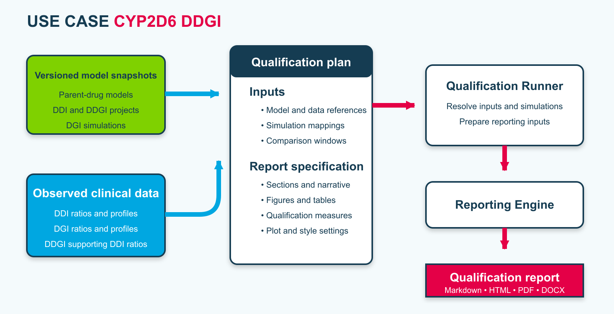
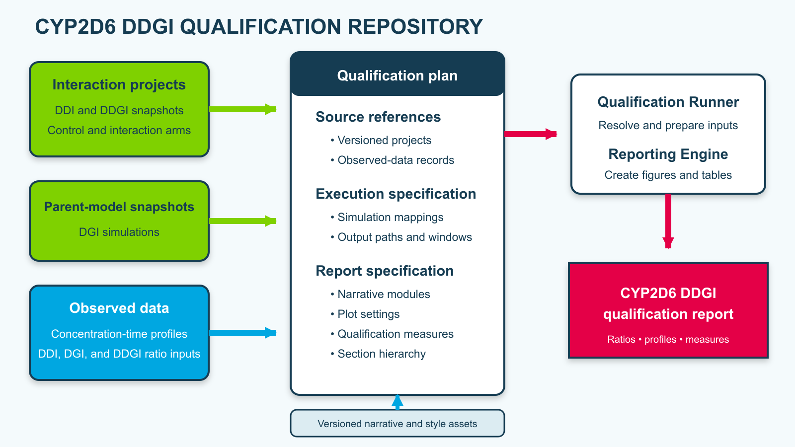

OSP provides versioned model repositories, observed clinical data, and a technical framework for qualification. The automatic requalification workflow contains four stages:

1. Develop and verify the PBPK models with observed data.
2. Create a machine-readable qualification plan for the intended use.
3. Execute the plan with Qualification Runner.
4. Generate the qualification report with OSPSuite.ReportingEngine.

Figure Appendix-2 summarizes this workflow for the CYP2D6 DDI, DGI, and DDGI use cases.

**Figure Appendix-2: OSP automatic requalification workflow**

The qualification plan identifies the model snapshots, simulations, observed datasets, output paths, comparison windows, figures, tables, and report sections. It can also describe cross-project dependencies and additional model-building steps. All quantitative results remain traceable to the referenced model snapshot and observed-data record.

Figure Appendix-3 shows how the CYP2D6 DDGI qualification repository connects these inputs to the report workflow.

**Figure Appendix-3: CYP2D6 DDGI qualification repository and data flow**

[Qualification Runner](https://github.com/Open-Systems-Pharmacology/QualificationRunner) resolves the referenced inputs and prepares the simulation and reporting inputs. [OSPSuite.ReportingEngine](https://github.com/Open-Systems-Pharmacology/OSPSuite.ReportingEngine) executes the reporting workflow and creates the figures, tables, and final report artifacts.

Requalification is required when a relevant model snapshot, observed dataset, qualification-plan mapping, OSP Suite version, Qualification Runner version, or Reporting Engine version changes. Before publication, the report must be regenerated from a clean environment. The generated Markdown, HTML, PDF, and DOCX artifacts must be checked against the qualification plan, the referenced model snapshots, and the workflow logs.
